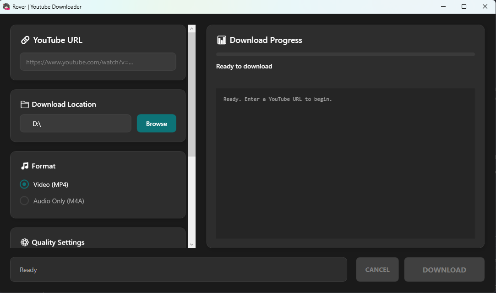

# Rover YouTube Downloader

Rover is a modern, user-friendly YouTube downloader built with WPF and C#. Easily download YouTube videos and audio with a sleek dark UI featuring real-time progress tracking and comprehensive logging.



## Features

- **Multiple Download Formats**: Video (MP4) or Audio-only (M4A)
- **Quality Options**:
    - **Video**: 480p (SD), 720p (HD), 1080p (FHD), 1440p (QHD), 2160p (4K)
    - **Audio**: 128kbps, 192kbps, 256kbps, 320kbps
- **Real-time Progress**: Detailed download progress with speed and ETA
- **Comprehensive Logging**: Full operation history with timestamps
- **File Management**: Automatically updates file timestamps after download
- **Modern Dark UI**: Clean, responsive interface with custom styling
- **Persistent Settings**: Remembers your download location preferences

## Download

Download the latest release from the [Releases](https://github.com/dlcuy22/Rover-YouTube-Downloader/releases) page. The release includes:

- Complete standalone application
- Built-in yt-dlp executable
- No additional installation required

## Requirements

- Windows 10/11
- .NET 9.0 Desktop Runtime (will be prompted to download if you don't have it)

## Usage

1. **Enter YouTube URL**: Paste any YouTube video link (video, playlist, or short)
2. **Select Format**: Choose between Video (MP4) or Audio (M4A)
3. **Set Quality**: Select your preferred video resolution or audio bitrate
4. **Choose Location**: Browse or use the default download folder
5. **Download**: Click "DOWNLOAD" and monitor progress in real-time
6. **Completion**: Get notified when download finishes and file is ready

## Supported Formats

**Input**: YouTube videos, playlists, shorts, and music videos  
**Output**:
- Video: MP4 (with embedded metadata and thumbnail)
- Audio: M4A (with embedded metadata and thumbnail)

## yt-dlp Integration

This application uses yt-dlp for YouTube downloading. The standalone release includes:

- `yt-dlp.exe` - YouTube download engine
- Automatic updates handled internally

These executables are bundled with the application to provide a complete, ready-to-use experience without requiring separate installation.

## Building from Source

### Prerequisites
- Visual Studio 2022 or later
- .NET 9.0 SDK
- yt-dlp executable (place `yt-dlp.exe` in the `python` directory)

### Build Steps
1. Clone the repository
```bash
git clone https://github.com/dlcuy22/Rover-YouTube-Downloader
cd Rover-YouTube-Downloader
```

2. Build the project
```bash
dotnet build --configuration Release
```

## Technical Details

- **Framework**: .NET 9.0 with WPF
- **YouTube Engine**: yt-dlp
- **UI**: Custom dark theme with modern styling
- **Progress Tracking**: Real-time parsing of yt-dlp output
- **Post-processing**: Automatic file timestamp modification

## License

This project is open source. yt-dlp is licensed under the Unlicense license.

## Contributing

Contributions are welcome! Feel free to open issues or submit pull requests for improvements and bug fixes.